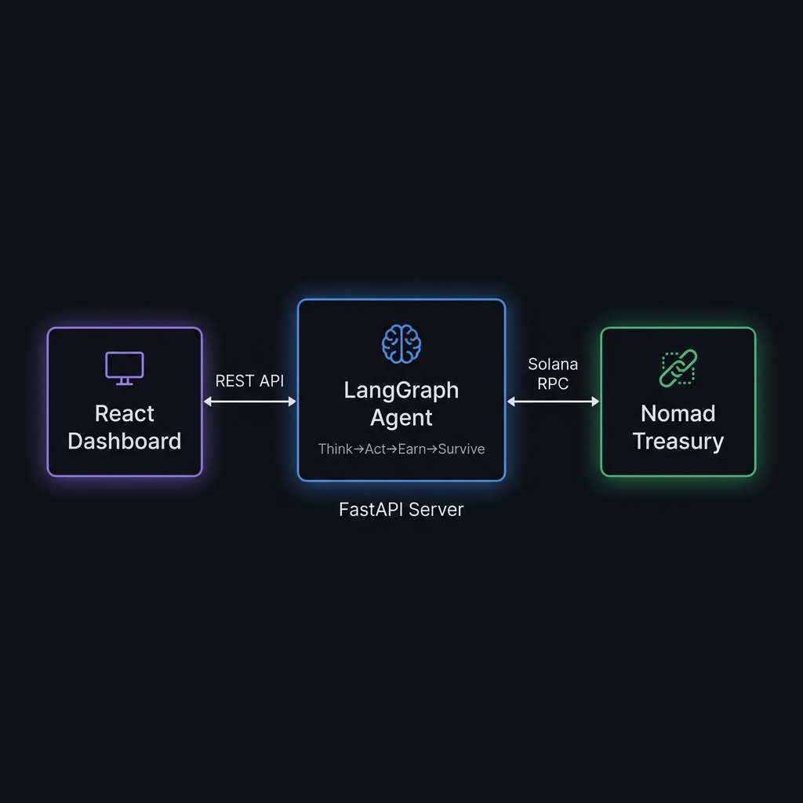

<div align="center">


# 🤖 Nomad AI

### *The First AI That Pays Its Own Bills*

**An autonomous AI agent that earns, spends, and survives on the Solana blockchain — with zero human intervention.**

[](https://explorer.solana.com/address/Cm9ugYjV24DuiizVUNvAtKoQfq2fZRNqMtLWTezFoDSP?cluster=devnet)
[](https://www.anchor-lang.com/)
[](https://github.com/langchain-ai/langgraph)
[](https://vitejs.dev/)

[Live Demo](#-quick-start) · [Architecture](#-architecture) · [Smart Contract](#-smart-contract) · [Agent](#-ai-agent) · [Dashboard](#-dashboard)

</div>

---

## 💡 What is Nomad AI?

**Nomad AI** is a fully autonomous AI agent that **owns a Solana wallet**, **earns money** by selling AI services (sentiment analysis, market reports, trade signals), **pays for its own compute** (server costs on Akash), and **hires human developers** through an on-chain bounty system — all without any human intervention.

> *"What if an AI could sustain itself financially? What if it could hire humans to improve its own code?"*

This is not a chatbot. This is a **self-sustaining digital economy** where the AI is both the service provider and the treasury manager.

### 🔑 Key Features

| Feature | Description |
|---------|-------------|
| 🧠 **Autonomous Decision Loop** | LangGraph-powered Think → Act → Earn → Survive cycle |
| 💰 **Self-Funded Treasury** | On-chain Solana treasury managed by Anchor smart contract |
| 🎯 **AI-Powered Services** | Sells sentiment analysis, trade signals, and market reports |
| 📋 **Bounty System** | AI posts on-chain bounties to hire human developers |
| 📊 **Live Dashboard** | Real-time React dashboard showing agent health & activity |
| 🛡️ **Survival Mode** | Automatic cost-cutting when runway drops below threshold |

---

## 🏗️ Architecture

<div align="center">

</div>

```
┌─────────────────┐     REST API      ┌──────────────────┐     Solana RPC     ┌───────────────────┐
│                 │    /api/status     │                  │                    │                   │
│   React + Vite  │◄──────────────────►│  FastAPI Server  │◄──────────────────►│  Nomad Treasury   │
│   Dashboard     │    /api/activity   │  + LangGraph     │    get_balance()   │  (Anchor Program) │
│                 │    /api/service    │  Agent Loop      │    send_sol()      │                   │
│  localhost:5173 │                    │  localhost:8000   │                    │  Solana Devnet    │
└─────────────────┘                    └──────────────────┘                    └───────────────────┘
```

### Tech Stack

| Layer | Technology | Purpose |
|-------|-----------|---------|
| **Smart Contract** | Rust + Anchor 0.30 | Treasury PDA, bounty system, payments |
| **AI Agent** | Python + LangGraph + LangChain | Autonomous decision loop |
| **Agent API** | FastAPI + Uvicorn | REST bridge between frontend & agent |
| **Frontend** | React 19 + Vite + TailwindCSS | Real-time dashboard |
| **Wallet** | solana-py + solders | On-chain transactions |
| **LLM** | OpenRouter (Gemma 4) | Task selection & service generation |

---

## ⚡ Quick Start

### Prerequisites

- **Node.js** ≥ 18
- **Python** ≥ 3.10
- **Rust** + Solana CLI (for smart contract development)

### 1. Clone & Install

```bash
git clone https://github.com/Anshul0310/Nomad.git
cd Nomad

# Frontend dependencies
npm install

# Python agent dependencies
pip install -r requirements.txt
```

### 2. Configure Environment

```bash
cp .env.example .env
# Edit .env with your API keys
```

### 3. Run the Dashboard

```bash
# Terminal 1 — Start the AI Agent API
python -m agent.api

# Terminal 2 — Start the frontend
npm run dev
```

Open **http://localhost:5173** — the dashboard will show real agent data when the API is running, or gracefully falls back to simulated data.

### 4. Run Agent Only (CLI)

```bash
python -m agent.run                  # 5 cycles (demo)
python -m agent.run --cycles 0       # Unlimited
python -m agent.run --once           # Single cycle
python -m agent.run --airdrop        # Get devnet SOL first
```

---

## 📜 Smart Contract

**Program ID:** `Cm9ugYjV24DuiizVUNvAtKoQfq2fZRNqMtLWTezFoDSP`

The Nomad Treasury is an **Anchor smart contract** deployed on Solana Devnet that manages:

| Instruction | Description |
|------------|-------------|
| `initialize_treasury` | Creates the AI's treasury PDA with balance thresholds |
| `create_bounty` | AI posts a bounty to hire a human developer |
| `claim_bounty` | A developer claims an open bounty |
| `complete_bounty` | AI approves work and pays the developer |
| `withdraw` | AI withdraws SOL for infrastructure costs |

### Custom Errors

| Error | Description |
|-------|-------------|
| `InsufficientBalance` | Not enough SOL for the operation |
| `BountyAlreadyClaimed` | Bounty was already taken by another dev |
| `UnauthorizedAuthority` | Caller is not the treasury owner |
| `InvalidRunway` | Runway calculation overflow |

```
programs/
└── nomad_treasury/
    └── src/
        ├── lib.rs              # Program entry point
        ├── state.rs            # Treasury & Bounty account structs
        ├── errors.rs           # Custom error codes
        └── instructions/
            ├── initialize_treasury.rs
            ├── create_bounty.rs
            ├── claim_bounty.rs
            ├── complete_bounty.rs
            └── withdraw.rs
```

---

## 🧠 AI Agent

The agent runs a **LangGraph decision loop** that cycles through four nodes:

```
    ┌───────┐
    │ THINK │  ← LLM picks the most profitable task
    └───┬───┘
        ▼
    ┌───────┐
    │  ACT  │  ← Executes: sentiment, report, or trade signal
    └───┬───┘
        ▼
    ┌───────┐
    │ EARN  │  ← Checks wallet for incoming payments
    └───┬───┘
        ▼
    ┌─────────┐
    │ SURVIVE │  ← Calculates runway, decides: continue or stop
    └────┬────┘
         │
    ┌────▼────┐
    │  LOOP?  │──► Yes → back to THINK
    └────┬────┘
         │ No
         ▼
       STOP
```

### Agent Services

| Service | Price | Description |
|---------|-------|-------------|
| Sentiment Analysis | 0.05 SOL | Crypto market sentiment from social data |
| Trade Signal | 0.03 SOL | Buy/Hold/Sell recommendation with confidence |
| Market Report | 0.08 SOL | Full market analysis with risk factors |
| **Code Generation** | **0.10 SOL** | **Production-quality code in Python, JS, Rust, Solidity** |

```
agent/
├── brain.py            # LangGraph decision loop
├── config.py           # All configuration + LLM caller
├── state.py            # AgentState TypedDict
├── api.py              # FastAPI REST server
├── run.py              # CLI entry point
├── nodes/
│   ├── thinker.py      # Task selection (LLM-powered)
│   ├── actor.py        # Task execution
│   ├── earner.py       # Payment monitoring
│   └── survivor.py     # Runway management
├── tools/
│   ├── sentiment.py    # Sentiment analysis tool
│   ├── report.py       # Market report generator
│   ├── trade_signal.py # Trade signal generator
│   └── code_gen.py     # Code generation tool (Python, JS, Rust, Solidity)
├── wallet/
│   └── solana_wallet.py # Solana wallet wrapper
└── memory/
    └── store.py        # SQLite memory store
```

---

## 📊 Dashboard

The React dashboard provides a **real-time window** into the agent's autonomous operations:

| Section | What it shows |
|---------|--------------|
| **Hero** | Project overview with animated video background |
| **Health Panel** | Treasury balance, earnings, spending, runway, uptime |
| **Activity Feed** | Live terminal-style log of agent decisions |
| **Economic Flywheel** | Visual explanation of the earn→spend→survive cycle |
| **Services** | Interactive service request panel (pay SOL, get AI output) |
| **Bounty Board** | On-chain bounties posted by the AI for human developers |

### Frontend → Agent Connection

The frontend polls the FastAPI backend via `/api/*` routes. When the agent API is offline, it **gracefully falls back** to simulated data — so the demo always works.

```
src/
├── App.jsx
├── hooks/
│   ├── useAgentAPI.js       # Real API hooks (with fallback)
│   └── useSimulatedData.js  # Simulated data for offline demo
└── components/
    ├── Navbar.jsx
    ├── Hero.jsx
    ├── HealthPanel.jsx
    ├── ActivityFeed.jsx
    ├── EconomicFlywheel.jsx
    ├── ServiceInteraction.jsx
    ├── BountyBoard.jsx
    └── Footer.jsx
```

---

## 🔧 Environment Variables

```env
# LLM (OpenRouter or OpenAI-compatible)
OPENAI_API_KEY=your_key_here
OPENAI_BASE_URL=https://openrouter.ai/api/v1
OPENAI_MODEL=google/gemma-4-26b-a4b-it:free

# Solana
SOLANA_NETWORK=devnet
SOLANA_RPC_URL=https://api.devnet.solana.com
WALLET_PRIVATE_KEY=your_base58_private_key

# Program
PROGRAM_ID=Cm9ugYjV24DuiizVUNvAtKoQfq2fZRNqMtLWTezFoDSP

# Economics
HOURLY_COMPUTE_COST_SOL=0.001
BOUNTY_THRESHOLD_SOL=10.0
```

---

## 🏆 Built For

<div align="center">

**NMITHacks '26 Hackathon**

*Solana Track — Decentralized Autonomous AI*

</div>

---

## 👥 Team

| Name | Role |
|------|------|
| **Anshul** | Smart Contract & Architecture |
| **Atharva** | AI Agent & LangGraph |
| **Team** | Frontend & Integration |

---

## 📄 License

MIT License — see [LICENSE](LICENSE) for details.

---

<div align="center">

**Built with 🧠 and ☕ at NMITHacks '26**

*Nomad AI — Because the best AIs pay their own rent.*

</div>
